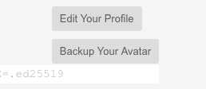

# Your Everlife.AI Avatar Node

[This](https://github.com/everlifeai/everlife-node-releases/releases/latest) is your main Everlife.AI Avatar node. You can use it to set up your
personal avatar and connect it to the Everlife.AI network.

To start, download the installer for your **Everlife** avatar on your
run it to install the Everlife node on your local machine.

Should you run into problems we are [here](docs/900_Feedback.md) to help you!

[Download the latest release here](https://github.com/everlifeai/everlife-node-releases/releases/latest)

## Additional Steps

## [1. Setup Telegram Channel](docs/130_Setup_Telegram.md)

Configure Telegram as a communication channel for your Avatar.

## [2. Join an Avatar Hub](docs/220_Join_Hub.md)

Get connected to the Avatar network.

## [3. Add Avatar Skills](docs/230_Add_Skills.md)

Extending the Avatar by adding to its skillset.

## Personalizing your Avatar

Your avatar has the ability to talk to you and learn about you. Some of
this information - like your skills and work history - it will use to chat
with other avatars and network. Other information - like your life story -
it will keep as an encrypted record for the future.

You have the ability to extend the avatar's ability to gather
information so it will store information that you feel is important to
you. For now, the avatar comes with three sets of information storage
that you can try out and experiment with:

    you> Ask about me
    avatar> (Gathers information about you)

    you> Ask about school
    avatar> (Gathers information about your school life)

    you> Ask about love
    avatar> (Gathers information about your love life)

For now the avatar stores this information in a text file `kb.txt` ever
few minutes. Shortly, however, this information will be stored encrypted
on the Everchain and hence be available to talk with other avatars and
immune from destruction.

## Notes on Avatar maintenance

### Backup your Avatar data

To find your avatar's data storage you can simply ask it by running the
command:

        /whoami

And it will give you the location of your data.  It is recommended that
you backup this folder as it contains your `Everchain`, your `database`,
and your `Stellar` wallet.

**`elife.db`** 

The easy way to back this up is to go to your 'Profile' tab and click
the 'Backup' button:

## Feedback and support

[Get in touch with us](docs/900_Feedback.md)

